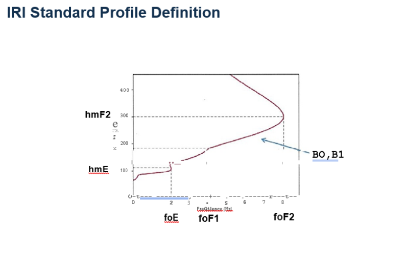

# ERT-Coding-Exercises

## Assessment IRI EDP:

Create a C-based modeling and simulation program that drives IRI model Fortran code. The code should capture and generate vertical EDP (Electron Density Profile) for a given time and location of interest.

time of interest: Mar 3 2021 UT 11:00:00 and Mar 4, 2021 UT 23:00:00
location of interest: Lat 37.8N and Lon 75.4W

Assessment Criteria:

1. Create a simple Makefile that can compile iri2016 (http://irimodel.org) and generate a shared object/library
2. Write a C-program that links with the shared object created and create all data needed for step 3)
3. Use gnuplot (www.gnuplot.info) or other similar C-based plotting tools to generate plots of EDP parameters using the shared objective created in step 1.
4. alternatively, use F2PY (https://www.numfys.net/howto/F2PY/) and Python to create EDP plots using the shared object created in step 1. (Although C-based plotting is the preferred solution)
5. Furnish instructions/documentation, etc. on how to run the code and lesson/insights learned by doing this exercise.

Example EDP plots:  

## Data Collection

You have been assigned to write an app that collects data from an outside source. The source is from the NOAA Space Weather Prediction Center (SWPC) and the data is the Real-Time Solar Wind (RTSW) from the NOAA/DSCOVR satellite. The source is available at: https://services.swpc.noaa.gov/products/geospace/propagated-solar-wind-1-hour.json

- Develop an application and/or associated with Application Programming Interfaces (APIs), in Python 3, that will download RTWS data.  
If you are asked to persist this data, how will you go about achieving this task? Write a persistent layer with extensibility in mind.  
Be aware that you need to extend it to other different NOAA data sources.  
Pay attention to cadence, real-time requirements, and network constraints.  
- (Optional) Finally, you are asked to containerize your app, please provide the appropriate necessary files, that will allow running your app as a container, in your favorite container runtime.
- (Bonus: web-gui) You are now tasked with writing a dashboard that will provide early warning of solar storms, you may use any web-based GUI framework, e., g React, Vue, angular, you wish to accomplish this task.  
- (Bonus: Machine Learning): Write a prediction engine that will try to forecast future space weather based on past data.  
What was your preferred approach to this problem?  
Test it for some time, how would you go about comparing it to the real results?

## Assessment Temporal relationship

In C, without using any third-party library except standard C library, write a function that can sort the following entries by date and time, from the oldest to the newest then write a median filter function that calculates foF2 and hmF2. 

See the attached AU930_ROAM.TXT [file missing]

## Assessment Typescript

Write a web page with a 400x400 pixel canvas and a single button.  
Using React to listen for the button click event, draw a circle 1/2 the size of the canvas in the upper right-hand corner of the canvas,  
and an ellipse in the lower left-hand corner of the canvas.  
Fill both the circle and the ellipse.